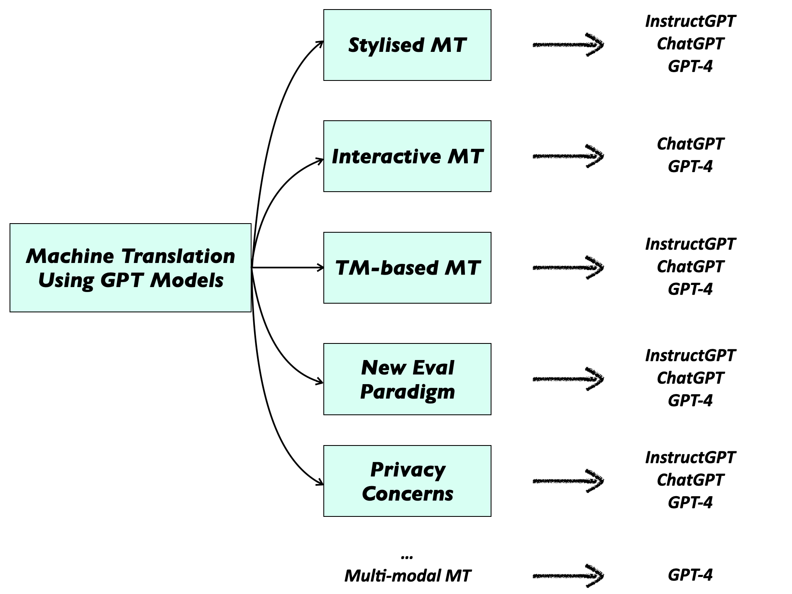
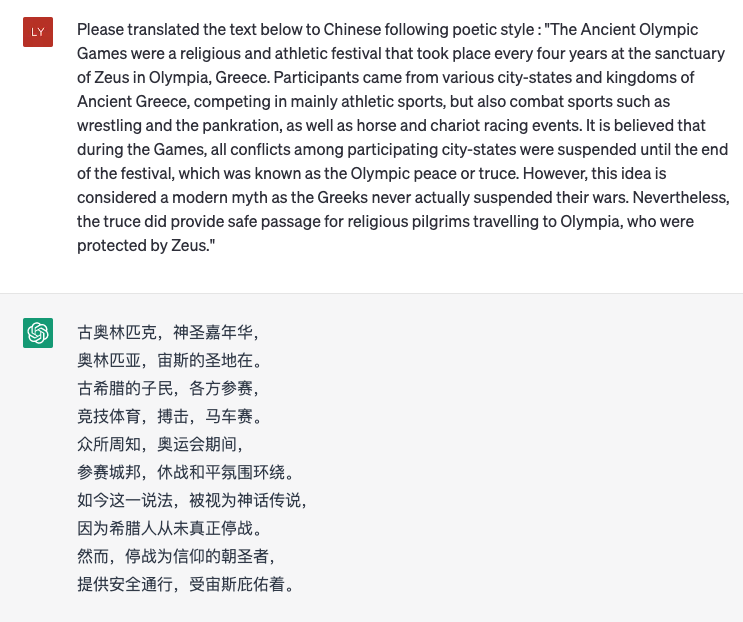
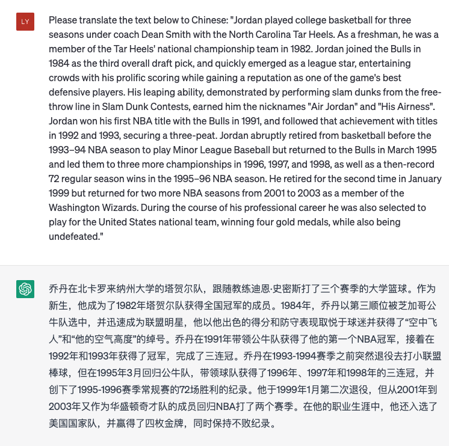
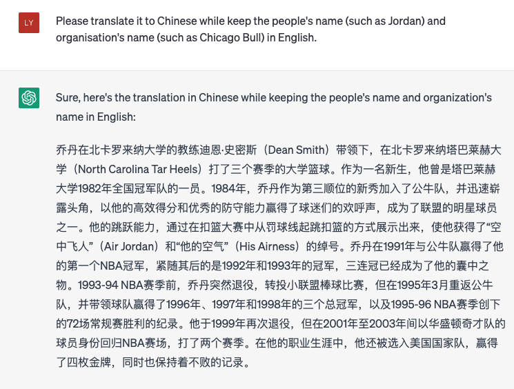
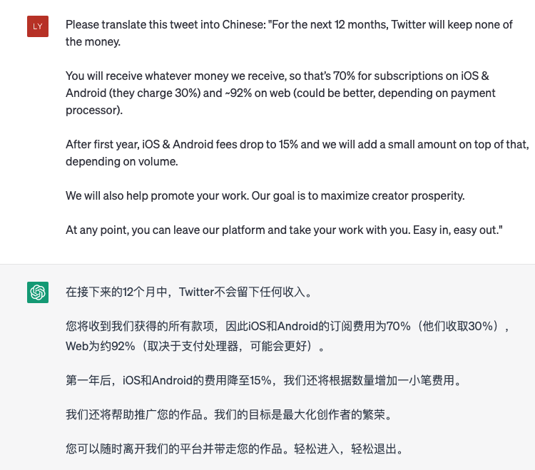
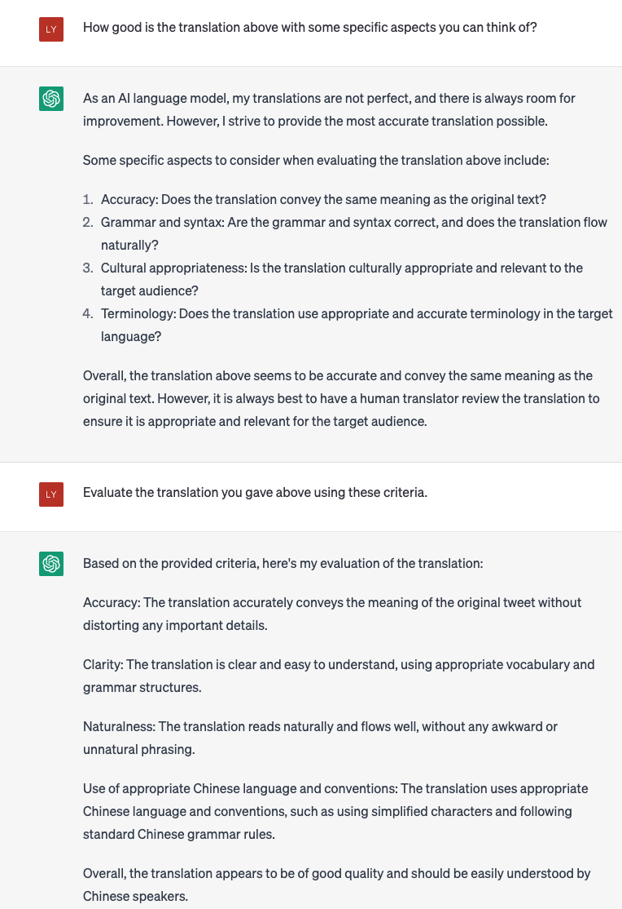
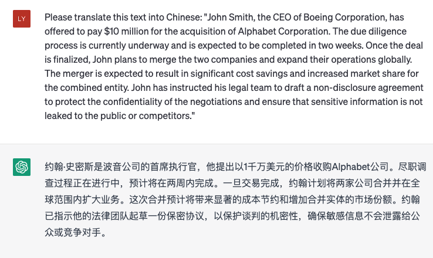
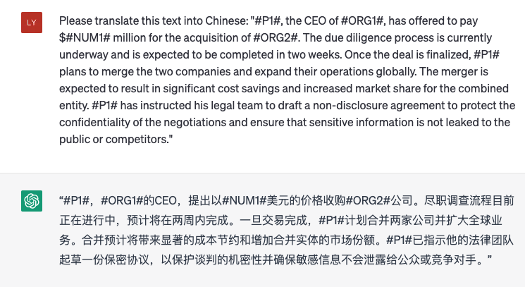

# New Trends in Machine Translation using Large Language Models
*<a href="https://lyuchenyang.github.io/">Chenyang Lyu</a>, <a href="https://jitao-xu.github.io/">Jitao Xu</a> and <a href="http://longyuewang.com/">Longyue Wang</a>*

<!-- ## Abstract -->
Machine Translation (MT) has made significant progress in recent years using deep learning, especially after the emergence of Large Language Models (LLMs) such as GPT-3 and ChatGPT. That brings new challenges and opportunities for MT using LLMs. In this blog, we brainstorm some interesting directions for MT using LLMs, including stylized MT, interactive MT, and Translation Memory-based MT, as well as new evaluation paradigm using LLMs. We also discuss the privacy concerns in MT using LLMs and show a basic privacy-preserving method to mitigate such risks. To illustrate the potential of our proposed directions, we present several examples for the new directions mentioned above, demonstrating the feasibility of the proposed directions and highlight the opportunities and challenges for future research in MT using LLMs.

## Introduction

  
  
  
 <b><a>Figure 0. Interesting directions for MT using LLMs (e.g. GPT models), including stylized MT, interactive MT, Translation Memory-based MT and new evaluation paradigm for MT using LLMs, as well as privacy concerns.</a></b> 

Machine translation (MT) is a fundamental task in natural language processing (NLP) that aims to automatically translate text from one language to another. Despite decades of research, MT still faces many challenges, such as dealing with idiomatic expressions, handling rare words, and maintaining coherence and fluency in the translated text. Recently, the emergence of large language models (LLMs), such as GPT-3 and ChatGPT, has significantly advanced the state-of-the-art in MT. The zero-shot MT performance of LLMs is even on par with strong fully supervised MT systems while LLMs can be used in various scenarios beyond MT [1][2].

However, MT using LLMs also poses new challenges and opportunities that require new directions and methodologies. In this blog, we brainstorm several interesting directions for MT using LLMs, including stylized MT, interactive MT, and Translation Memory (TM) based MT, as well as a potential new evaluation paradigm using LLMs. Stylized MT aims to preserve the stylistic features of the source text in the translation output, such as the tone, register, or genre. Interactive MT aims to facilitate the collaboration and feedback between human users and MT systems, such as through chatbots or question-answering systems. The new evaluation paradigm using LLMs aims to leverage the power of LLMs for more accurate and efficient evaluation of MT systems from various aspects instead of only evaluating the similarity between system output and references.

In addition to the new directions and methodologies, we also discuss the privacy concerns in MT using LLMs and propose basic privacy-preserving methods to mitigate the risks. Privacy in MT using LLMs is becoming an increasingly important issue, as LLMs may inadvertently reveal sensitive information in the source text or the translation output. 

To premilinarily investigate the feasibility of the interesting directions mentioned above, we present several examples using ChatGPT for MT under various scenarios, demonstrating the feasibility of the directions. Our results demonstrate the potential of the potential new directions and methodologies for enhancing the quality and diversity of MT output, as well as the importance and challenges of privacy in MT using LLMs. We conclude by highlighting the opportunities and challenges for future research in MT using LLMs and suggesting potential directions for further exploration.

## Stylized MT

  
  
  
 <b><a>Figure 1. An example of prompting ChatGPT to translate text from English to Chinese using poetic style.</a></b> 

Stylized MT refers to the ability to generate translations that match a specific style or genre [3], such as formal or informal language, poetry or prose, or different dialects or registers. This can be achieved by training MT systems on parallel datasets that contain translations in different styles or genres, or by using style transfer techniques that can transform a given translation into a desired style. Stylized MT has many potential applications, such as in marketing, literature, or cultural preservation. However, stylized MT is difficult to achieve before the presence of LLMs as there lacks of such parallel corpora for stylized MT to fit various stylies while the zero-shot ability of LLMs make such tasks feasible. We can directly prompt LLMs to translate text with specific style expressed by natural language or we can firstly let LLMs translate the original text and then stylize the translation output. We present an example of translating an introduction for Olympic game from Wikipedia from English to Chinese while following poetic style in the figure above. This example shows that ChatGPT can handle translation with poetic style, which can be hardly achieved by traditional MT systems.

However, stylized MT also poses several challenges. One challenge is how to define and measure different styles or genres in a systematic and scalable way. Another challenge is how to evaluate the quality of stylized MT, as traditional evaluation metrics may not be sufficient to capture the diversity of stylistic variations. Overcoming these challenges requires interdisciplinary collaboration between linguists, literary scholars, and computer scientists.

## Interactive MT

  
  
  
  
  
 <b><a>Figure 2. An example of using ChatGPT for interactive MT.</a></b> 

Interactive MT allows users to actively participate in the translation process, either by correcting or refining automatic translations or by providing feedback on the translation quality. This can be achieved by integrating MT systems based on LLMs with interactive user interfaces, such as chatbots or online forums, that allow users to engage with the translation process in real time to provide feedback and more specific requirements. Interactive MT can help to improve the accuracy and fluency of translations, especially in cases where the source language is ambiguous or the domain knowledge is limited.

However, interactive MT also raises several challenges. One challenge is how to design user interfaces that are intuitive and user-friendly, yet also informative and flexible. Another challenge is how to incorporate user feedback into the translation process in a principled and effective way. Overcoming these challenges requires insights from human-computer interaction, natural language processing, and user experience design.

## Translation Memory-based MT

TM has been used for decades to help translators in basic Computer-Aided Translation (CAT) systems. The general process of using TM in MT is, for a sentence to be translated, to first search for similar translations in MT using, for instance, fuzzy matching techniques [4], then revise or edit the retrieved similar translation in order to obtain a high quality translation. TM-based MT has already been integrated into conventional neural MT systems. The use of retrieved similar sentence pairs seems to be a natural fit to few-shot prompting techniques when performing MT using LLMs. LLMs has emerged the In-Context Learning (ICL) ability that they can learn specific tasks through task examples given in the prompt. 

However, existing works so far have mostly used randomly selected translation examples as prompts and suggest that using semantically similar examples does not significantly further improve the translation performance. Most of these works used sentence-level embeddings built by an external model to retrieve similar examples via embedding similarity search. On the contrary, other studies using fuzzy match to retrieve similar translations have shown significant improvements. Therefore, the conclusion about the effectiveness of using similar translations in MT using LLMs still remains unclear. Since TMs can provide useful domain and style information that can help LLMs to generate translations that better meets the translation requirement, it is a promising direction to further study how to better integrate TMs into LLMs for MT.

Previous studies on conventional TM-based MT have also shown that conventional Transformer-based NMT system already shows the ability to make use of new TMs that have never been seen by the model during training to largely improve domain-specific translation during inference. This indicates that conventional NMT systems learn to understand the relationship between a given source sentence and a similar translation and to select useful information from the given similar translation, rather than simply remember sentences seen during training. This ability is, to some extent, similar to the ICL ability of LLMs. However, to the best of our knowledge, there does not exist research works focusing on finding the relationships between these two abilities.

## New Evaluation Paradigm for MT using LLM

  
  
  
  
  
 <b><a>Figure 3. An example of using ChatGPT for evaluating translation outputT.</a></b> 

Evaluating the quality of MT using LLMs is a challenging task, as existing evaluation metrics may not be sufficient to capture the full range of translation quality. In addition, existing open-access test sets may suffer from the data contamination problem as they are possibly used during the training process of LLMs. Evaluating on these test sets cannot correctly reflect the MT performance of LLMs. A new evaluation paradigm for MT using LLMs should take into account the unique characteristics of LLM-based MT, such as the ability to generate fluent but inaccurate translations or the sensitivity to domain-specific knowledge. Possible approaches to a new evaluation paradigm include using human evaluations or even directly employ LLMs to evaluate the translation output - although studies show that LLMs would prefer the translation output from LLMs instead of other systems [5]. An example of using ChatGPT to evaluate the translation output for a tweet from Elon Musk is shown in Figure 3.

However, developing a new evaluation paradigm also poses several challenges. One challenge is how to balance the trade-off between evaluation efficiency and evaluation quality, as human evaluations can be time-consuming and expensive and LLM-based evaluation can be biased. Another challenge is how to ensure the reliability and validity of the evaluation results, as different evaluators may have different subjective judgments or biases. Overcoming these challenges requires rigorous experimental design, statistical analysis, and transparency in reporting.

## Privacy in MT using LLM

  
  
  
  
  
 <b><a>Figure 3. An example of privacy issue in using ChatGPT for MT. The upper one is the example where the input is not anonymized, thus containing people's name information, etc. The latter one is the example where the sensitive information in the input is anonymized.</a></b> 

As LLMs become more powerful and widely used in MT, there are growing concerns about privacy and security. In particular, LLMs may inadvertently reveal sensitive information in the source text or the translation output, such as personally identifiable information, confidential business data, or political opinions. Privacy in MT using LLMs aims to mitigate these risks by developing privacy-preserving methods that can protect the confidentiality and integrity of the translation process.

One basic approach to privacy in MT using LLMs is to anonymize sensitive information in the textual input and then pass it to LLMs and get the output, which is then de-anonymized. An example of such privacy issue using LLMs and our basic solution is shown below.

However, privacy in MT using LLMs also poses several challenges. One challenge is how to balance the trade-off between privacy and accuracy, as privacy-preserving methods may introduce additional noise or distortion to the translation output. Another challenge is how to ensure the interoperability and compatibility of privacy-preserving methods across different languages, models, and platforms. Overcoming these challenges requires collaboration between experts in cryptography, privacy, and MT, as well as adherence to ethical and legal standards.

## Future Directions
Personalized MT - With the advancements in LLM-based MT, the focus can be shifted towards personalized MT. This approach can enable the provision of customized translations that are tailored to each user's preferences and needs. It can include translations that are adapted to the user's language proficiency, domain-specific terminology, or cultural references. One possible approach to provide personalized MT is to prompt LLMs with user-specific preferences or metadata, such as user search histories or social media posts. The zero-shot ability of LLMs makes such tasks feasible, which is difficult to achieve in previous MT systems because such data is usually unavailable. However, personalized MT raises several challenges. One challenge is how to collect and store user-specific data in a privacy-preserving manner. Another challenge is how to measure the effectiveness of personalized MT, as traditional evaluation metrics may not capture the nuances of user preferences and needs. Overcoming these challenges requires careful consideration of ethical, legal, and technical issues.

Multi-modal MT - Another promising direction is multi-modal MT, which involves integrating visual, audio, or other non-textual information into the translation process. This approach can enhance the quality and accuracy of translations in various settings, such as image or video captioning, speech recognition, and sign language translation. LLMs, such as GPT-4, can be employed to develop models that can learn from multimodal data and generate translations that accurately convey the meaning of the input. However, multi-modal MT poses several challenges, such as data heterogeneity, unbalanced datasets, and domain specificity. Overcoming these challenges would require developing novel algorithms that can learn from multimodal data and generalize well across different modalities and domains.

## References

[1] Wang, Longyue, et al. "Document-Level Machine Translation with Large Language Models." arXiv preprint arXiv:2304.02210 (2023).

[2] Jiao, Wenxiang, et al. "Is ChatGPT a good translator? A preliminary study." arXiv preprint arXiv:2301.08745 (2023).

[3] Wang, Yifan, et al. "Controlling Styles in Neural Machine Translation with Activation Prompt." arXiv preprint arXiv:2212.08909 (2022).

[4] Moslem, Yasmin, Rejwanul Haque, and Andy Way. "Adaptive Machine Translation with Large Language Models." arXiv preprint arXiv:2301.13294 (2023).

[5] Liu, Yang, et al. "GPTEval: NLG Evaluation using GPT-4 with Better Human Alignment." arXiv preprint arXiv:2303.16634 (2023).
